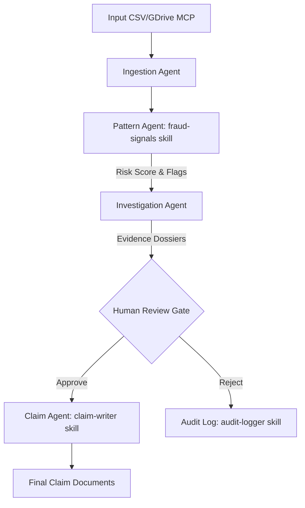

# ReturnSense: Multi-Agent Return Fraud Detection System
## Design Specification (DESIGN_SPEC.md)

ReturnSense is a multi-agent system designed for Indian D2C (Direct-to-Consumer) sellers. It automates the detection of return fraud patterns, compiles detailed evidence dossiers, and drafts marketplace claims to help merchants recover losses on platforms like Amazon, Flipkart, Myntra, and Meesho.

---

## 1. System Architecture & Component Interaction

The system utilizes the **Google Agent Development Kit (ADK)** to orchestrate a pipeline of specialized agents. Each agent runs sequentially, processing data and appending findings to the context.

---

## 2. Agent Specifications

### 2.1 Ingestion Agent
* **File**: [ingestion_agent.py](file:///d:/agy2-projects/my-first-project/agy-cli-projects/returnsense/app/ingestion_agent.py)
* **Responsibility**: 
  - Reads order and return CSV files locally or via the Google Drive MCP.
  - Validates required fields (`order_id`, `customer_id`, `customer_name`, `order_date`, `order_value_inr`, `return_date`, `return_reason`, `return_weight_g`, `original_weight_g`, `platform`, `city`, `payment_mode`).
  - Standardizes date formats and normalizes numeric values.
  - Outputs a structured list of transaction records.

### 2.2 Pattern Agent
* **File**: [pattern_agent.py](file:///d:/agy2-projects/my-first-project/agy-cli-projects/returnsense/app/pattern_agent.py)
* **Responsibility**:
  - Implements the custom `fraud-signals` skill.
  - Scores customers for fraud risk based on rules.
  - Flags high-risk patterns and returns structured risk indicators.

### 2.3 Investigation Agent
* **File**: [investigation_agent.py](file:///d:/agy2-projects/my-first-project/agy-cli-projects/returnsense/app/investigation_agent.py)
* **Responsibility**:
  - Takes flagged records (MEDIUM/HIGH risk) and compiles history.
  - Calculates specific KPIs (e.g., total return rate, return-to-order ratio).
  - Drafts an evidence dossier including weight differences, date logs, and potential address matching clusters.

### 2.4 Claim Agent
* **File**: [claim_agent.py](file:///d:/agy2-projects/my-first-project/agy-cli-projects/returnsense/app/claim_agent.py)
* **Responsibility**:
  - Implements the `claim-writer` skill.
  - Translates the evidence dossier into a formatted claim template (generic and marketplace-specific drafts for Amazon, Flipkart, etc.).
  - Auto-drafts reasons, listing order ID, platform, weight discrepancy, and refund value.

### 2.5 Orchestrator (Root Agent)
* **File**: [agent.py](file:///d:/agy2-projects/my-first-project/agy-cli-projects/returnsense/app/agent.py)
* **Responsibility**:
  - Subclass of ADK `SequentialAgent`.
  - Coordinates data flow from Ingestion ➔ Pattern ➔ Investigation ➔ (Human Review) ➔ Claim.
  - Implements the `audit-logger` skill to record the exact path, inputs, and outputs at every step.
  - Integrates the PII security layer and intercepts execution for manual review.

---

## 3. Custom Agent Skills

### 3.1 `fraud-signals` Skill
* **Path**: [.agents/skills/fraud-signals/SKILL.md](file:///d:/agy2-projects/my-first-project/agy-cli-projects/returnsense/.agents/skills/fraud-signals/SKILL.md)
* **Detection Signals**:
  1. **Serial Returner** (Weight: 30 pts):
     - `>3` returns in a 30-day sliding window.
     - Multi-platform exploitation by same `customer_id`.
  2. **Swap Fraud** (Weight: 35 pts):
     - Returned weight `return_weight_g` is `< 50%` of original weight `original_weight_g`.
     - `return_reason` is `"wrong_item"` AND the weight discrepancy is `> 200g`.
  3. **COD Abuse** (Weight: 20 pts):
     - `payment_mode` is `COD` AND customer has `>2` returns.
     - Repetitive return reasons like `"not_as_described"` or `"wrong_color"` on COD orders.
  4. **Address/Identity Ring** (Weight: 25 pts):
     - Orders from the same city with the exact same order value under different customer names.
     - Same delivery address cluster with `>3` returned orders.
  5. **Policy Exploit** (Weight: 15 pts):
     - Consistently initiates return requests within 48 hours of delivery.
     - Alternates between generic return reasons (e.g., `"not_as_described"`, `"wrong_color"`).
* **Scoring Heuristic**:
  - `Risk Score = Sum of all triggered signal weights (capped at 100)`
  - **Risk Classification**:
    - `Score >= 70`: **HIGH_RISK** (Auto-flagged for claim compilation).
    - `Score >= 40`: **MEDIUM_RISK** (Flagged for review).
    - `Score < 40`: **LOW_RISK** (Clean, skipped).
* **Safety Overrides**:
  - Customers with `0` or `1` total returns are NEVER flagged as HIGH_RISK.
  - All scoring actions must mask `customer_name` to `[MASKED]` and log metadata to the audit file.

### 3.2 `claim-writer` Skill
* **Path**: [.agents/skills/claim-writer/SKILL.md](file:///d:/agy2-projects/my-first-project/agy-cli-projects/returnsense/.agents/skills/claim-writer/SKILL.md)
* **Formats**:
  - Generates claims with standard templates (Amazon SAFE-T, Flipkart SPF, Myntra PPP, Meesho Seller Claim).
  - Drafts copyable plain-text or Markdown containing: order metadata, discrepancy proof (e.g., weight check), and estimated loss amount.

### 3.3 `audit-logger` Skill
* **Path**: [.agents/skills/audit-logger/SKILL.md](file:///d:/agy2-projects/my-first-project/agy-cli-projects/returnsense/.agents/skills/audit-logger/SKILL.md)
* **Mechanism**:
  - Logs system activity to an append-only JSONL format (`data/audit_trail.jsonl`).
  - Every log entry includes: `timestamp`, `agent_name`, `input_payload_hash`, `output_summary`, `decisions_made`.
  - Ensures compliance, traceability, and zero retention of plaintext PII data.

---

## 4. Security & Compliance Controls

1. **PII Masking**: Masking of customer names, email regex patterns, phone numbers (+91 matches), and PAN/ID card formats prior to log persistence.
2. **Human-in-the-Loop Checkpoint**: A CLI console/API approval prompt requiring an input of `"APPROVE"` before the Claim Agent compiles and writes files.
3. **Audit Log Integrity**: Strict separation of user details and system activity logs. The audit logs are immutable and append-only.
