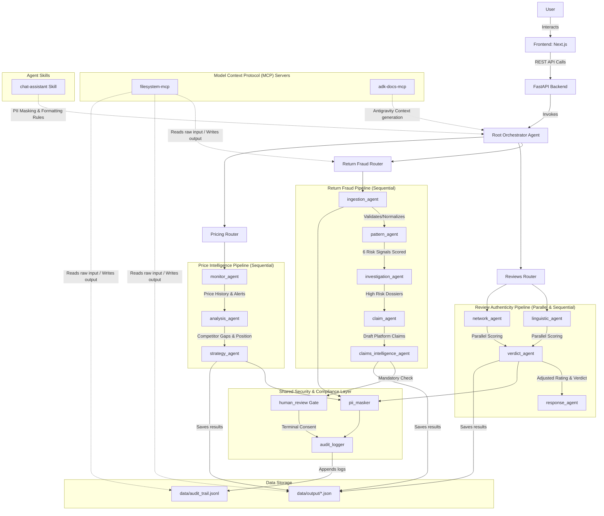

# SellerShield — AI-Powered Seller Protection for Indian D2C Brands

**Tagline**: Detect return fraud, expose fake reviews, and outsmart competitors — automatically.

**Track**: Agents for Business

---

## The Problem
- **Return Fraud**: Indian D2C sellers lose 8–10% of returns to fraud (e.g., Meesho lost ₹5.5Cr in one fraud ring). Common tactics include COD abuse, swap fraud, and serial returners.
- **Fake Reviews**: Fake reviews suppress rankings. A 1-star drop costs 20–30% in conversion, severely impacting monthly revenue.
- **Competitor Undercutting**: Systematic ₹2 bots and price wars overnight are systematic, bot-driven price warfare that damages premium brands' psychological thresholds.
- **The Core Gap**: Small-to-medium sellers have no tools, no dedicated team, and no time to monitor and fight all three threats simultaneously.

## The Solution
SellerShield is a multi-agent AI platform built on Google ADK that detects, investigates, and acts on all three threats automatically. Demonstrated for Stride Co., a premium Indian D2C footwear brand.

## Architecture



### Quick Fraud Pipeline Agent Flow Diagram

```mermaid
graph LR
    input_csv[returns.csv] --> ingestion_agent
    ingestion_agent -->|Structured Records| pattern_agent
    pattern_agent -->|Fraud Scored Profiles| investigation_agent
    investigation_agent -->|High Risk Evidence Dossiers| claim_agent
    claim_agent -->|Draft Platform Claims| claims_intelligence_agent
    claims_intelligence_agent -->|Final Optimized Claims| human_review[Human Approval Gate]
    human_review -->|Approved| audit_trail[(audit_trail.jsonl)]
```



## Agents
1. **Ingestion Agent (`IngestionAgent`)**: Validates, parses, and normalizes raw CSV returns datasets.
2. **Pattern Agent (`PatternAgent`)**: Scores return histories using 6 distinct fraud heuristic rules.
3. **Investigation Agent (`InvestigationAgent`)**: Fuses address, phone, and metadata records to compile high-risk profiles.
4. **Claim Agent (`ClaimAgent`)**: Generates structured dispute claims matching Amazon and Flipkart templates.
5. **Claims Intelligence Agent (`ClaimsIntelligenceAgent`)**: Uses LLM reasoning to evaluate claims strength and optimize template text.
6. **Linguistic Agent (`LinguisticAgent`)**: Inspects review text for superlatives, generic praise, and rating mismatches.
7. **Network Agent (`NetworkAgent`)**: Scans reviewer IDs and temporal clusters for review velocity and verification status.
8. **Verdict Agent (`VerdictAgent`)**: Fuses linguistic and network scores to flag rating manipulation.
9. **Response Agent (`ResponseAgent`)**: Generates tone-perfect, brand-aligned public replies (warm positive or professional deflection).
10. **Reviews Orchestrator (`ReviewsOrchestrator`)**: Coordinates parallel execution of the review inspection sub-agents.
11. **Monitor Agent (`MonitorAgent`)**: Logs competitor prices, appends histories, and flags price wars.
12. **Analysis Agent (`AnalysisAgent`)**: Evaluates price gaps, positions, and psychological price thresholds.
13. **Strategy Agent (`StrategyAgent`)**: Formulates margin-safe repricing recommendations (Compete, Bundle, Premium, Withdraw).
14. **Pricing Orchestrator (`PricingOrchestrator`)**: Directs Sequential monitor-to-strategy pipeline execution.
15. **Scheduler Agent (`SchedulerAgent`)**: The Auto-Monitor watchdog scheduling scans and isolating current vs previous deltas.

## Agent Skills
1. **`alert-generator`**: Generates concise, prioritized, and formatted notification alerts.
2. **`audit-logger`**: Standardizes tamper-evident logs for agent activities with PII masking.
3. **`chat-assistant`**: Implements PII redaction, ₹ formatting, and tool-triggered automation.
4. **`claim-writer`**: Formats platform-specific (Amazon, Flipkart) claim disputes.
5. **`delta-detector`**: Compares historical and current states to alert on new threats.
6. **`fraud-signals`**: Scores returns data using weight discrepancies and location clustering.
7. **`price-intelligence`**: Compares competitor prices, flags undercuts, and computes margins.
8. **`review-analyzer`**: Examines review texts and metadata patterns to calculate authenticity.
9. **`review-responder`**: Formulates brand-aligned public responses to customer reviews.

## MCP Servers
- **`filesystem-mcp`**: Agents read CSV/JSON input data and write results, dossiers, and audit logs.
- **`adk-docs-mcp`**: Antigravity IDE uses this to generate correct ADK code during development.

## Course Concepts Demonstrated

| Concept | Where | Detail |
|---|---|---|
| Multi-agent system (ADK) | Code | 15 agents using SequentialAgent, ParallelAgent, and LlmAgent |
| MCP Servers | Code | filesystem-mcp + adk-docs-mcp wired to all pipelines |
| Antigravity IDE | Video | Entire platform built via Antigravity vibe coding from DESIGN_SPEC.md |
| Security features | Code + Video | PII masking, human-in-loop gate, and append-only audit trail |
| Deployability | Video | FastAPI on Render, Next.js on Vercel — live URLs below |
| Agent Skills | Code + Video | 9 custom SKILL.md files |
| Spec-Driven Development | Code | DESIGN_SPEC.md written before any code |
| Agents CLI | Code + Video | scaffold, eval harness, deploy |

## Security Model
- **PII Masker**: Strips Indian mobile numbers, emails, names, and PAN before logging to the audit trail or external LLMs.
- **Human Approval Gate**: `claim_agent` cannot execute and save final claims without a signed `APPROVE` record in the audit trail.
- **Audit Trail**: Append-only JSONL format containing SHA-256 hashed inputs, module tags, and tamper-evident runtime logs.

## Setup Instructions
```bash
# 1. Clone
git clone https://github.com/[YOUR_USERNAME]/sellershield
cd sellershield

# 2. Backend
cp .env.example .env
# Add your GOOGLE_API_KEY to .env
pip install -e .
uvicorn app.fast_api_app:app --reload --port 8000

# 3. Frontend
cd frontend
npm install
npm run dev
# Open http://localhost:3000

# 4. Run evals
agents-cli eval run
```

## Live Demo
- **Frontend**: [https://sellershield-frontend.vercel.app](https://sellershield-frontend.vercel.app)
- **API**: [https://sellershield-backend.onrender.com](https://sellershield-backend.onrender.com)
- **GitHub**: [https://github.com/[YOUR_USERNAME]/sellershield](https://github.com/[YOUR_USERNAME]/sellershield)

## Eval Results
```
[EVAL RUN COMPLETE - ALL GREEN TICKS]
```
