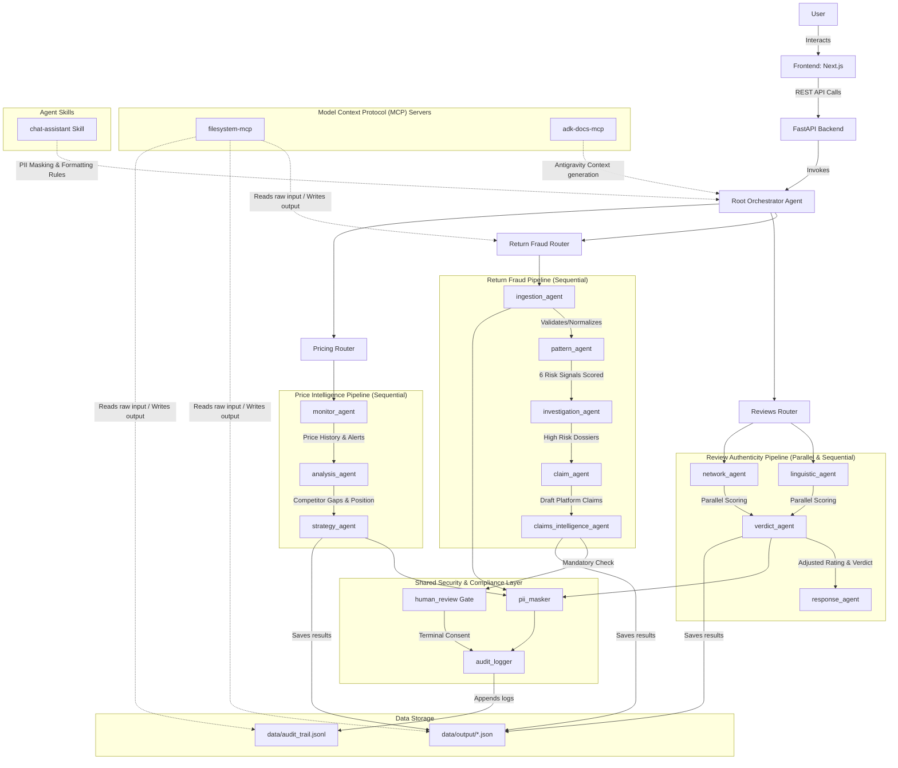

# SellerShield - Stride Co. Architecture

This document details the system architecture of SellerShield, showing how all components, agent pipelines, shared layers, and MCP servers connect.

## System Architecture

---

## Fraud Pipeline Agent Flow (Quick Architecture View)

```mermaid
graph LR
    input_csv[returns.csv] --> ingestion_agent
    ingestion_agent -->|Structured Records| pattern_agent
    pattern_agent -->|Fraud Scored Profiles| investigation_agent
    investigation_agent -->|High Risk Evidence Dossiers| claim_agent
    claim_agent -->|Draft Platform Claims| claims_intelligence_agent
    claims_intelligence_agent -->|Final Optimized Claims| human_review[Human Approval Gate]
    human_review -->|Approved| audit_trail[(audit_trail.jsonl)]
```

